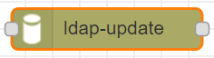
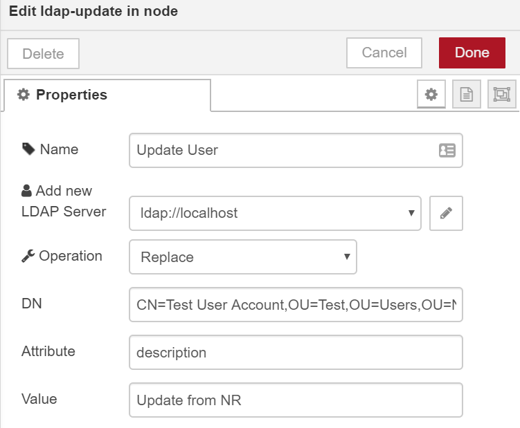
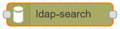
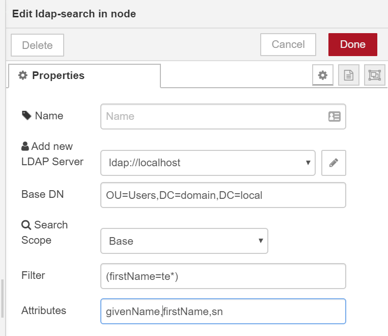

# node-red-contrib-better-ldap

Better LDAP includes nodes which implement the [ldapjs][ldapjs] api. Some nodes
have been simplified to help ease of use.

Install
-------

Run the following command in the root directory of your Node-RED install

    npm install node-red-contrib-better-ldap

Nodes
-------
***Update Node***

Update node is used to update an attribute on an LDAP object by DN

Operation, DN, Attribute, and Value can be accessed via
`msg.operation`, `msg.dn`, `msg.attribute`, `msg.payload`
respectively.

Node sets `msg.ldapStatus` with the result of operation. 

***Search Node***

Search node is used to run a search query against a LDAP server. 
You must use a standard LDAP filter query. 
More information on ldap queries can be found [here][filterQuery]

#### Properties
`Base DN` the base LDAP object to start your search

`Scope` Scope can be either `base`, `one`, or `sub`
- base - Only search the base dn. no further sub directories
- one - Search only one directory down from the base dn
- sub - Search all directories and sub directories

`filter` LDAP filter criteria

`attributes` Attributes to be returned for each object. A comma separated list of attributes to change.
Default attributes are defined. They are targeted toward user queries. 
Provide 

Defaults:

`dn`, `userPrincipalName`, `sAMAccountName`, `objectSID`, `mail`,
                  `lockoutTime`, `whenCreated`, `pwdLastSet`, `userAccountControl`,
                  `employeeID`, `sn`, `givenName`, `initials`, `cn`, `displayName`,
                  `comment`, `description`, `title`, `department`, `company`

If you wanted to search for all objects where `firstName` starts with `te` you 
would use the filter `(firstName=te*)` where `te` is the search term and `*` is a wild card.

Configuration
-------

Host, port, username, and password are required to configure a new LDAP client.    
    
License
-------

See [license](https://github.com/rocky3598/node-red-contrib-better-ldap/blob/master/LICENSE)
    
[ldapjs]: https://github.com/joyent/node-ldapjs    
[filterQuery]: https://docs.ldap.com/specs/rfc4515.txt
